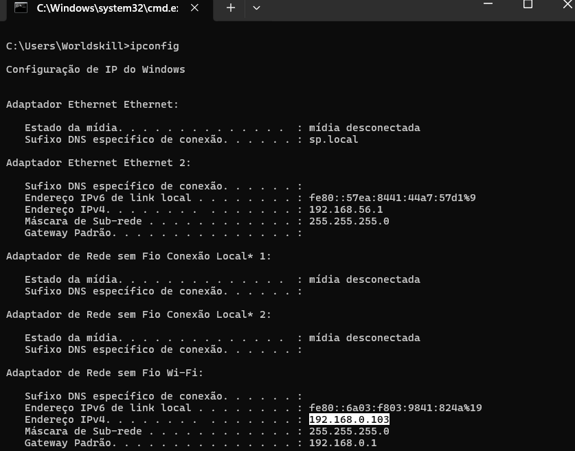
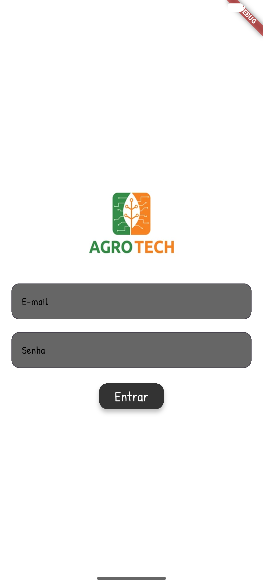
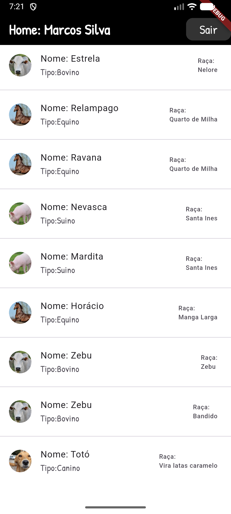
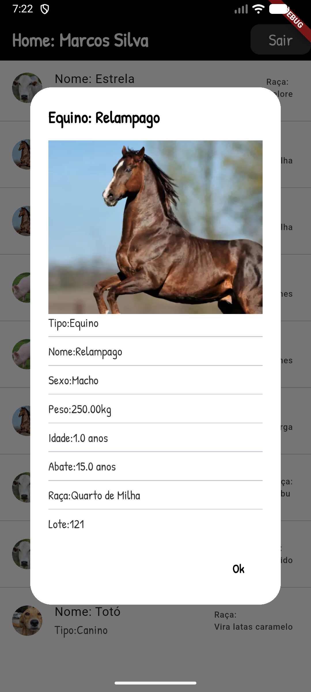
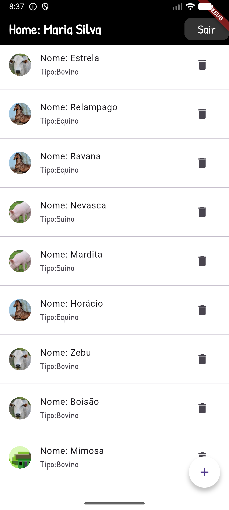
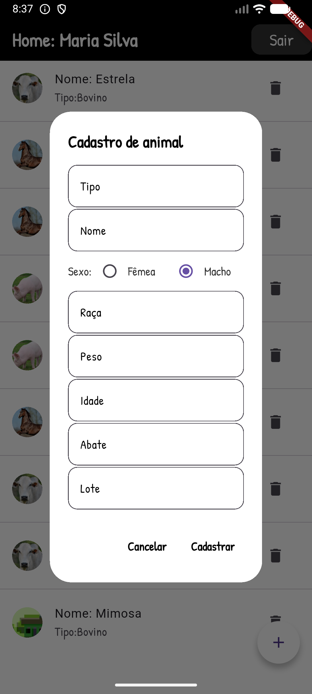
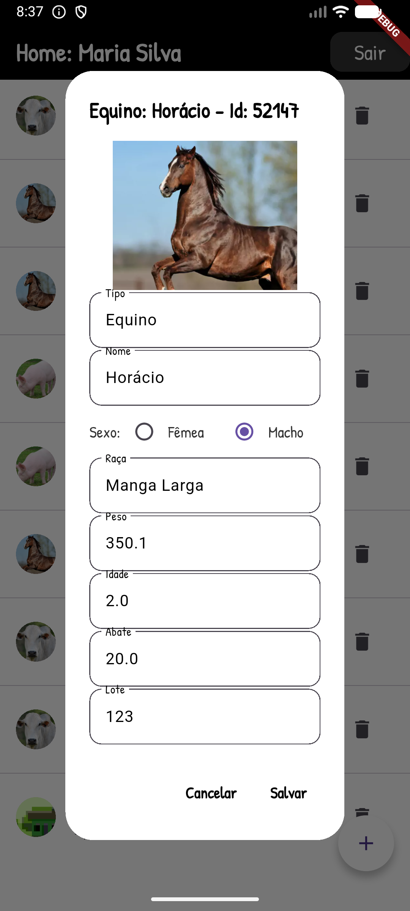
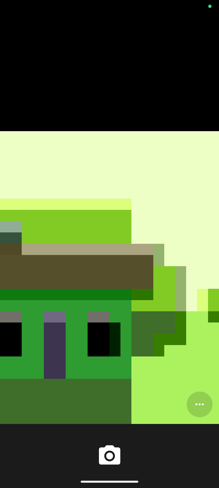

# App AgroTech

Projeto educacionail para aulas de *programação para dispositivos moveis* com o framework **flutter**
- Tela de Login
- Tela Home
- API com autenticação JWT
- Acesso a [câmera para tirar fotografia](./image_picker.md)
- Enviar foto para API

## Tema Agronegócio
Duas coleções de dados, *um para muitos*, um **usuário**/funcionário muitos **animais**

## Tecnologias
- Flutter
- Android Studio
- VsCode

## Para testar
- 1 Clone o repositório da [API](https://github.com/wellifabio/agro-api-jserver-swagger.git), necessário Node.js instalado no computador
    - Abra com VsCode, e em um terminal execute os comando a seguir para instalar as dependências e executar
    ```bash
    npm install
    npm run dev
    ```
- 2 Clone este repositório
    - Abra com VsCode e em um terminal execute os comando a seguir para instalar as dependências e executar
    ```bash
    flutter pub get
    flutter run
    ```
    - Escolha executar em um navegador *Chrome* ou em um emulador do **Android Studio**
    - Para testar no **Emulador** troque o *localhost* em lib/root/api.dart para o ip do seu computador, para saber seu **IP** digite **ipconfig** em um terminal
    ```dart
    class Api {
        static const String baseUrl = 'http://localhost:3000';
        static const String login = '$baseUrl/login';
        static const String users = '$baseUrl/users';
        static const String animais = '$baseUrl/animais';
        static const String arquivos = '$baseUrl/static/';
    }
    ```
    - 
    - Exemplo para o IP: 192.168.0.103
    ```dart
    class Api {
        static const String baseUrl = 'http://192.168.0.103:3000';
        static const String login = '$baseUrl/login';
        static const String users = '$baseUrl/users';
        static const String animais = '$baseUrl/animais';
        static const String arquivos = '$baseUrl/static/';
    }
    ```

### Wireframes


### Print das telas
||||
|:-:|:-:|:-:|
|Tela de login|Home|Detalhes|

|||||
|:-:|:-:|:-:|:-:|
|Ícones de create e delete|Modal de cadastro|Modal de alteração|Camera|


